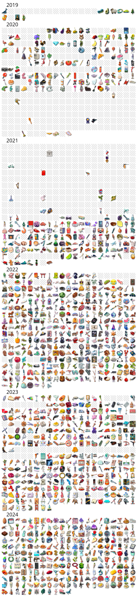

# Vertex Data

This is an archive of data from the NY Times game Vertex.  This only includes the data behind 
the games, and is missing several data files for past games.  If you either implement a way 
to play old games, or have the data behind the missing games, 
please contact me on [reddit](https://www.reddit.com/user/nobody514/).

And if you want to see what this data 
looks like, [here are all of the images](https://q726kbxun.github.io/vertex/index.html), 
and [here are videos of the playthrough](videos.md) of all of these puzzles.

